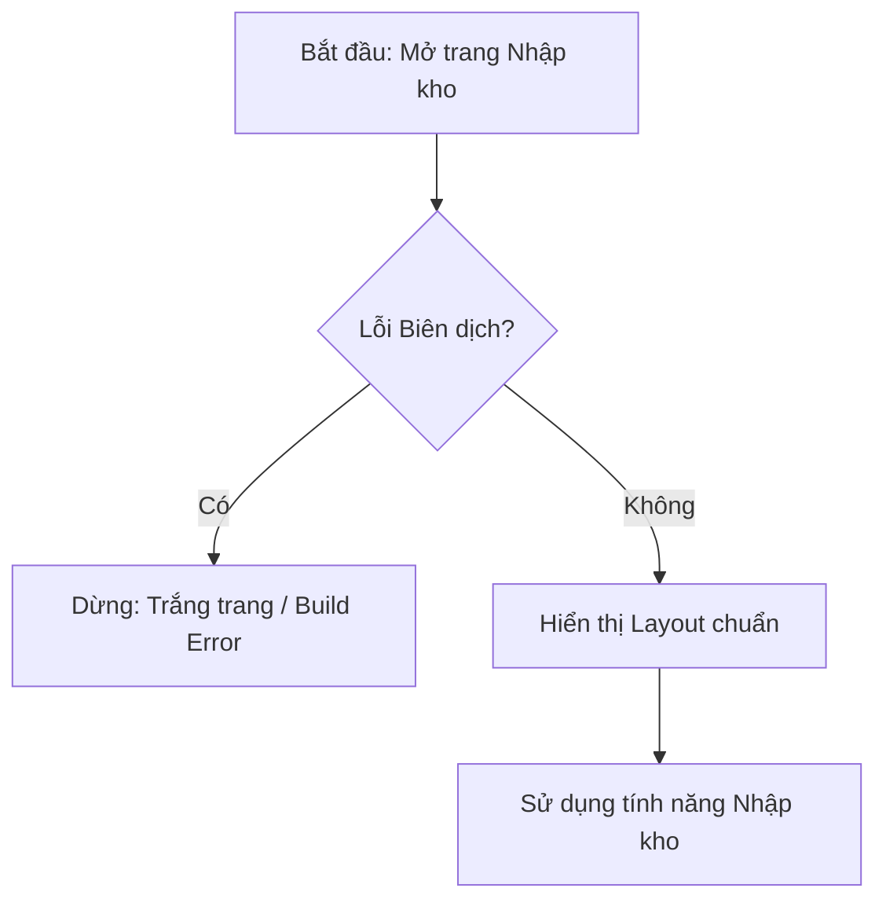

# 📑 SOFTWARE REQUIREMENT SPECIFICATION (SRS) - Task030

**Mã SRS:** `SRS_Task030_fix-inbound-page-parse-error`
**Trạng thái:** ✅ Completed
**Tính năng:** Khắc phục lỗi biên dịch (Parse Error) tại trang Nhập kho.

---

## 1. Tầm nhìn (Vision)
Khôi phục khả năng hoạt động của hệ thống bằng cách sửa lỗi cú pháp JSX, đảm bảo quy trình phát triển và đóng gói không bị gián đoạn.

## 2. Phạm vi (Scope)
- **In-scope:** Sửa lỗi thiếu thẻ đóng `
` trong file `InboundPage.tsx`.
- **Out-of-scope:** Refactor logic filter/sort hoặc thay đổi giao diện các component con.

## 3. Luồng nghiệp vụ (Business Flow)

## 4. Đặc tả kỹ thuật (Technical Mapping)
- **File:** `src/features/inventory/pages/InboundPage.tsx`
- **Lỗi:** JSX nesting error (Dòng 89 chưa được đóng).

## 5. Tiêu chí nghiệm thu (Acceptance Criteria - BDD)

### Scenario: Khắc phục lỗi biên dịch trang Nhập kho
- **Given:** File `InboundPage.tsx` đang thiếu thẻ đóng `
`.
- **When:** Thêm thẻ `
` vào cuối khối return (trước dấu `)` của return).
- **Then:** Chạy lệnh `npm run build` hoặc khởi động dev server phải thành công.
- **And:** Truy cập `/inventory/inbound` (hoặc route tương ứng) phải thấy giao diện đầy đủ.

---
**Người lập:** Agent PM (Dựa trên CR_Task030)
