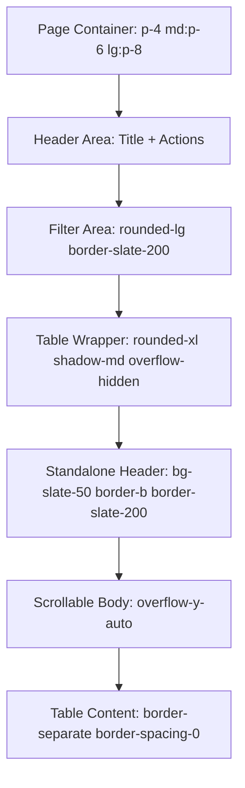

# 📑 SOFTWARE REQUIREMENT SPECIFICATION (SRS) - Task033

**Mã SRS:** `SRS_Task033_inventory-tables-standardization`
**Trạng thái:** ✅ Completed
**Tính năng:** Chuẩn hóa giao diện Bảng dữ liệu Inventory (Dispatch & Stock).

---

## 1. Tầm nhìn (Vision)
Mang lại sự nhất quán hoàn hảo (Seamless Consistency) cho module Inventory của Mini-ERP, giúp người dùng chuyển đổi giữa các module mà không cần làm quen lại với bố cục giao diện.

## 2. Phạm vi (Scope)
- **In-scope:**
  - Trang **DispatchPage** & Component **DispatchTable**.
  - Trang **StockPage** & Component **StockTable**.
- **Out-of-scope:** Các module Bán hàng (Sales), Mua hàng (Purchase) chưa đề cập trong yêu cầu hiện tại.

## 3. Quy trình nghiệp vụ (Standard Layout Flow)
Tất cả các trang Table phải tuân thủ cấu trúc sau (Mermaid):

## 4. Đặc tả kỹ thuật (Technical Mapping)

### 4.1 DispatchPage (Xuất kho & Điều phối)
- **Wrapper**: `flex-1 flex flex-col min-h-0 bg-white border border-slate-200/60 rounded-xl overflow-hidden shadow-md`.
- **Header Section**: Cố định `DispatchTableHeader` trong `div` có `bg-slate-50 border-b border-slate-200 pr-[10px]`.
- **Body Section**: `overflow-y-auto relative scroll-smooth`.

### 4.2 StockPage (Tồn kho)
- **Page Wrapper**: Chuyển đổi sang `h-full flex flex-col` để hỗ trợ sticky header đúng chuẩn.
- **StockTable Component**:
  - Tách `StockTableHeader` thành component riêng.
  - Áp dụng `border-separate border-spacing-0`.
  - Giữ lại chức năng **Checkbox selection** nhưng đảm bảo alignment khớp với Header.

## 5. Tiêu chí nghiệm thu (Acceptance Criteria - BDD)

### Scenario: Chuẩn hóa UI trang Dispatch
- **Given:** Người dùng đang ở trang **Xuất kho**.
- **When:** Cuộn danh sách phiếu xuống dưới.
- **Then:** Thanh tiêu đề của bảng (Mã phiếu, Khách hàng, ...) phải luôn cố định ở trên cùng.
- **And:** Spacing và Shadow phải khớp hoàn toàn với trang **Nhập kho**.

### Scenario: Chuẩn hóa UI trang Stock (Tồn kho)
- **Given:** Người dùng đang ở trang **Tồn kho**.
- **When:** Xem danh sách SKU.
- **Then:** Mã SP (skuCode) phải hiển thị bằng font mono (`font-mono text-xs font-semibold`).
- **And:** Layout bảng phải tuân thủ quy tắc Standalone Header, không còn dùng `sticky top-0` nội bộ trong thẻ `TableHeader`.

---
**Người lập:** Agent BA
**Ngày:** 17/04/2026
