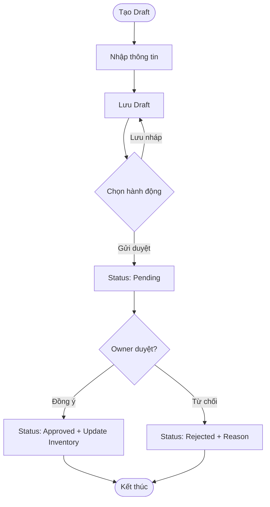
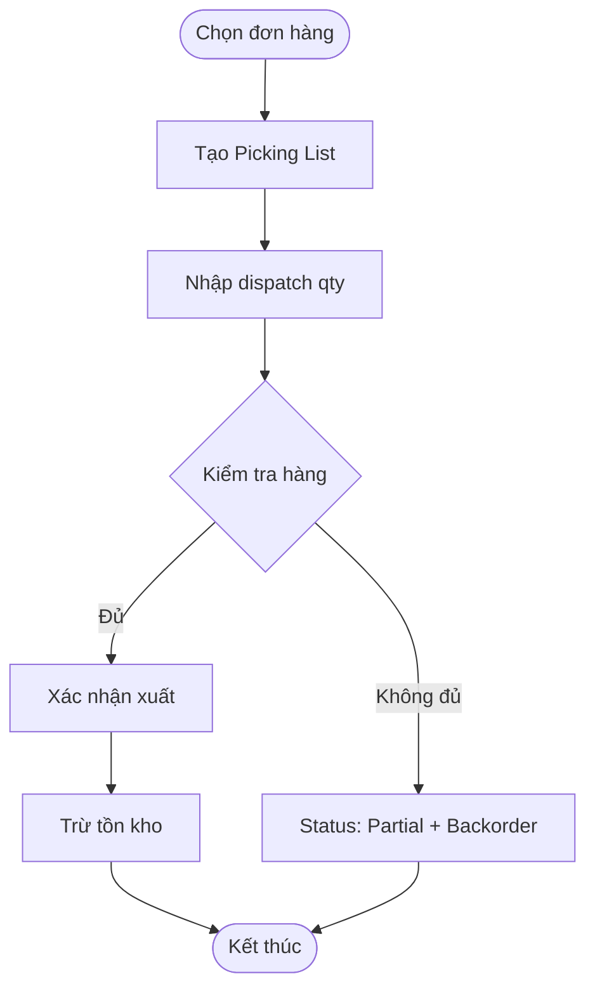
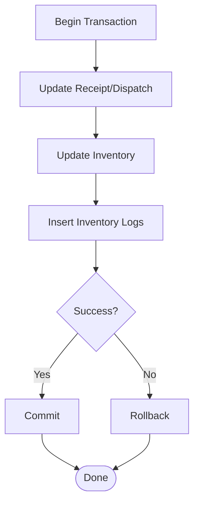

# SRS - CRUD Phiếu Nhập Kho & Xuất Kho

> **File**: `docs/srs/SRS_Task039_inbound-dispatch-crud.md`
> **Người viết**: Agent BA
> **Ngày tạo**: 18/04/2026
> **Phiên bản**: 1.0
> **Trạng thái**: Completed ✅
> **Task**: Task039

---

## 1. Tầm nhìn (Vision)

Tính năng CRUD cho Phiếu Nhập Kho và Phiếu Xuất Kho cho phép Staff tạo, sửa, xóa phiếu trực tiếp trên hệ thống và triển khai workflow phê duyệt để Owner kiểm soát. Giải quyết vấn đề: hiện tại chỉ có Read, không thể tạo/sửa phiếu.

---

## 2. Phạm vi (In-scope/Out-of-scope)

### 2.1 In-scope

- **Phiếu Nhập Kho**: Create, Update (Draft), Delete (Draft), Submit → Approve/Reject workflow
- **Phiếu Xuất Kho**: Create từ đơn hàng, Input dispatch qty, Confirm xuất → trừ tồn kho
- **Picking List**: Auto-generated từ Inventory
- **Partial Dispatch**: Handle không đủ hàng → Backorder

### 2.2 Out-of-scope

- Scan OCR (phase sau)
- Auto-generate từ đơn đặt hàng
- SMS/Email notifications
- Báo cáo chi tiết

---

## 3. Persona & Quyền (RBAC)

| Hành động | Owner | Staff | Admin |
| :--- | :---: | :---: | :---: |
| Tạo phiếu | ✅ | ✅ | ✅ |
| Sửa phiếu Draft | ✅ | ✅ | ✅ |
| Xóa phiếu Draft | ✅ | ✅ | ✅ |
| Gửi phê duyệt | ✅ | ✅ | ✅ |
| Phê duyệt phiếu nhập | ✅ | ❌ | ✅ |
| Từ chối phiếu nhập | ✅ | ❌ | ✅ |
| Xác nhận xuất kho | ✅ | ✅ | ✅ |
| Hủy phiếu | ✅ | ✅ | ✅ |

---

## 4. User Stories

### 4.1 Phiếu Nhập Kho (Inbound)

- **US01**: Là một Staff, tôi muốn tạo phiếu nhập mới để ghi nhận hàng nhập từ NCC.
- **US02**: Là một Staff, tôi muốn sửa phiếu nhập Draft để chỉnh sửa sai sót.
- **US03**: Là một Staff, tôi muốn xóa phiếu nhập Draft để loại bỏ phiếu không hợp lệ.
- **US04**: Là một Staff, tôi muốn gửi phiếu nhập để Owner phê duyệt.
- **US05**: Là một Owner, tôi muốn phê duyệt phiếu nhập để cập nhật tồn kho.
- **US06**: Là một Owner, tôi muốn từ chối phiếu nhập để yêu cầu chỉnh sửa.

### 4.2 Phiếu Xuất Kho (Dispatch)

- **US07**: Là một Staff, tôi muốn tạo phiếu xuất từ đơn hàng để ghi nhận xuất hàng.
- **US08**: Là một Staff, tôi muốn nhập số lượng xuất thực tế để xác nhận đã lấy hàng.
- **US09**: Là một Staff, tôi muốn xác nhận xuất kho để trừ tồn kho.
- **US10**: Là một Staff, tôi muốn xem Picking List để biết lấy hàng ở đâu.
- **US11**: Là một Staff, tôi muốn xử lý xuất một phần khi không đủ hàng.
- **US12**: Là một Staff/Owner, tôi muốn hủy phiếu xuất khi có sai sót.

---

## 5. Business Flow (Mermaid)

### 5.1 Inbound Workflow



### 5.2 Dispatch Workflow



---

## 6. Acceptance Criteria (BDD/Gherkin)

### 6.1 US01: Tạo phiếu nhập

**Happy Path:**
```gherkin
Given Chưa có phiếu nhập nào
When Tôi tạo phiếu nhập mới với đầy đủ thông tin
And Lưu nháp
Then Hệ thống tạo phiếu mới với status = "Draft"
And Hiển thị toast "Lưu phiếu nháp thành công"
```

**Unhappy Path:**
```gherkin
Given Không chọn nhà cung cấp
When Tôi click "Lưu nháp"
Then Hiển thị lỗi "Vui lòng chọn nhà cung cấp"
```

---

### 6.2 US05: Phê duyệt phiếu nhập

**Happy Path:**
```gherkin
Given Phiếu nhập có status = "Pending"
When Owner click "Phê duyệt"
And Xác nhận trong dialog
Then Status đổi thành "Approved"
And Inventory quantity tăng theo receipt details
And Hiển thị toast "Phê duyệt thành công"
```

---

### 6.3 US09: Xác nhận xuất kho

**Happy Path:**
```gherkin
Given Phiếu xuất có status = "Pending"
When Staff click "Xác nhận xuất kho"
And Xác nhận trong dialog
Then Status đổi thành "Full"
And Inventory quantity giảm theo dispatch items
And Hiển thị toast "Xuất kho thành công"
```

---

## 7. UI/UX Spec

### 7.1 Breakpoints

| Breakpoint | Width | Layout |
|----------|-------|--------|
| Mobile | < 640px | Single column, card view |
| Tablet | 640-1024px | 2 columns |
| Desktop | > 1024px | Full table + sidebar |

### 7.2 Components (Shadcn UI)

- `Dialog`: Form tạo/sửa phiếu
- `Sheet`: Detail panel (trượt từ phải)
- `Table`: Danh sách phiếu
- `Form` + `Input` + `Select`: React Hook Form + Zod
- `Button`: Actions
- `Badge`: Status indicators

### 7.3 States

| State | UI |
|-------|-----|
| Loading | Skeleton |
| Error | Toast notification |
| Empty | EmptyState component |
| Submitting | Button loading |

---

## 8. Technical Mapping

### 8.1 Route

- `/inventory/inbound` - Phiếu nhập kho
- `/inventory/dispatch` - Phiếu xuất kho

### 8.2 Feature Folder

- `src/features/inventory/pages/InboundPage.tsx`
- `src/features/inventory/pages/DispatchPage.tsx`
- `src/features/inventory/components/ReceiptForm.tsx` (mới)
- `src/features/inventory/components/DispatchForm.tsx` (mới)
- `src/features/inventory/components/ReceiptDetailPanel.tsx`
- `src/features/inventory/components/DispatchDetailPanel.tsx`

### 8.3 State Management

- **Server State**: TanStack Query v5
- **Local State**: React useState/useReducer
- **Form**: React Hook Form + Zod

---

## 9. Data & Database Mapping

### 9.1 Tables Affected

| Table | Operation | Notes |
| :--- | :--- | :--- |
| `stock_receipts` | INSERT, UPDATE, DELETE | Core table |
| `stock_receipt_details` | INSERT, DELETE | Line items |
| `stock_dispatches` | INSERT, UPDATE, DELETE | Core table |
| `dispatch_items` | INSERT, UPDATE | Line items |
| `inventory` | UPDATE | Auto on approve/confirm |
| `inventory_logs` | INSERT | Audit trail |

### 9.2 Transaction Boundary



---

## 10. Open Questions

- [ ] OCR - có trong phase này không?
- [ ] Email/SMS notifications?
- [ ] Print format?

---

## 11. QA Checklist

- [ ] Input tuân thủ RULES.md?
- [ ] Form validation Zod?
- [ ] Workflow đúng?
- [ ] Inventory update đúng?
- [ ] Audit trail ghi?
- [ ] RBAC đúng?
- [ ] 100% tiếng Vi���t?
- [ ] Responsive?

---

> **Status**: ✅ SRS Complete